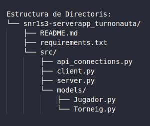

# SERVER APP TURNONAUTA

**Altres Repositoris del Projecte**    
[API](https://github.com/Snr1s3/TurnoNauta_FastAPI.git)    
[MOBIL](https://github.com/Snr1s3/Turnonauta.git)    
[WEB](https://github.com/EdwindanielTIC/web_TurnoNauta.git)  


## Estructura de Directoris


## requeriments.txt

### Llista de Dependències
- **`aiohappyeyeballs==2.6.1`**: Millora la resolució DNS i la fiabilitat de les connexions en aplicacions asíncrones.
- **`aiohttp==3.11.16`**: Un potent framework HTTP asíncron per gestionar peticions i respostes HTTP.
- **`aiosignal==1.3.2`**: Gestiona senyals asíncrones, utilitzat internament per `aiohttp`.
- **`asyncio==3.4.3`**: Una llibreria per escriure codi asíncron utilitzant la sintaxi `async` i `await` de Python.
- **`attrs==25.3.0`**: Simplifica la creació de classes amb menys codi redundant.
- **`frozenlist==1.5.0`**: Proporciona llistes immutables, utilitzades internament per `aiohttp`.
- **`idna==3.10`**: Gestiona noms de domini internacionalitzats (IDN), utilitzat per al parsing d'URLs.
- **`multidict==6.4.2`**: Implementa estructures de multidict, utilitzades per `aiohttp` per gestionar capçaleres HTTP i paràmetres de consulta.
- **`propcache==0.3.1`**: Una llibreria per a la memòria cau de propietats en objectes Python.
- **`yarl==1.19.0`**: Una llibreria per al parsing i la manipulació d'URLs, utilitzada internament per `aiohttp`.

```bash
# instal·lar requeriments.txt
pip install -r requirements.txt
```

## src/api_connections.py
Aquest fitxer conté funcions asíncrones per interactuar amb l'API REST del projecte. Les funcions principals són:

### Funcions disponibles

- **`getPlayersBySos(tournament_id, shared_session)`**  
  Obté una llista de jugadors ordenats per SOS d'un torneig.  
  **Mètode HTTP**: `GET`  
  **Endpoint**: `/puntuacions/get_by_tournament_ordered/{tournament_id}`

- **`getRondesAcabades(tournament_id, shared_session)`**  
  Comprova si les rondes d'un torneig han acabat.  
  **Mètode HTTP**: `GET`  
  **Endpoint**: `/rondes/ronda_acabada?torneig_id={tournament_id}`

- **`post_add_puntuacio(user_id, tournament_id, shared_session)`**  
  Afegeix puntuacions inicials per a un jugador en un torneig.  
  **Mètode HTTP**: `POST`  
  **Endpoint**: `/puntuacions/add`  
  **Payload**:
  ```json
  {
      "id_torneig": "tournament_id",
      "id_usuari": "user_id",
      "sos": 0,
      "victories": 0,
      "empat": 0,
      "derrotes": 0,
      "punts": 0
  }
  ```

- **`post_add_ronda(id_jugador1, id_jugador2, tournament_id, shared_session)`**  
  Afegeix una ronda entre dos jugadors en un torneig.  
  **Mètode HTTP**: `POST`  
  **Endpoint**: `/rondes/add`  
  **Payload**:
  ```json
  {
      "id_torneig": "tournament_id",
      "id_player1": "id_jugador1",
      "id_player2": "id_jugador2"
  }
  ```

- **`delete_puntuacions_tournament(tournament_id, shared_session)`**  
  Elimina totes les puntuacions d'un torneig.  
  **Mètode HTTP**: `DELETE`  
  **Endpoint**: `/puntuacions/delete_puntuacions_tournament/{tournament_id}`

- **`delete_puntuacions_user(user_id, tournament_id, shared_session)`**  
  Elimina les puntuacions d'un jugador específic en un torneig.  
  **Mètode HTTP**: `DELETE`  
  **Endpoint**: `/puntuacions/delete_by_user/{user_id}/{tournament_id}`

## src/server.py

Aquest fitxer conté la implementació del servidor principal per gestionar els tornejos i les connexions dels jugadors. Utilitza `asyncio` per gestionar operacions asíncrones i `aiohttp` per interactuar amb l'API REST del projecte.

### Funcionalitats principals

- **Gestió de tornejos**:
  - **`create_tournament`**: Crea un nou torneig i l'afegeix al diccionari global.
  - **`print_tournaments`**: Mostra els tornejos actius i els seus jugadors.
  - **`start_tournament`**: Comença els tornejos que tenen suficients jugadors i estan en estat "esperant".
  - **`make_parings`**: Genera els emparellaments per a les rondes dels tornejos.

- **Gestió de jugadors**:
  - **`register_player`**: Registra un jugador en un torneig.
  - **`is_player_registered`**: Comprova si un jugador ja està registrat en algun torneig.
  - **`remove_disconnected_player`**: Elimina un jugador desconnectat d'un torneig.

- **Notificacions**:
  - **`notify_tournament_players`**: Notifica els jugadors d'un torneig sobre esdeveniments com emparellaments o finalització del torneig.

- **Gestió de connexions**:
  - **`handle_client`**: Gestiona les connexions entrants dels clients i processa els seus missatges.
  - **`send_error_message`**: Envia missatges d'error als clients.

- **Tasques periòdiques**:
  - **`periodic_get_request`**: Consulta periòdicament l'API per obtenir tornejos actius i actualitzar el servidor.
  - **`check_connections_and_notify`**: Verifica l'estat dels jugadors i notifica els tornejos.

- **Servidor principal**:
  - **`main`**: Configura i inicia el servidor, executant les tasques periòdiques i gestionant les connexions dels clients.


## src/client.py

Aquest fitxer conté un client asíncron que simula jugadors connectant-se al servidor. És útil per provar el comportament del servidor i verificar la gestió de connexions i missatges.

### Funcionalitats principals

- **Connexió al servidor**:
  - El client es connecta al servidor utilitzant l'adreça IP i el port configurats.
  - Envia un missatge inicial amb el format: `0.{tournament_id}.{player_id}.player{player_id}`.

- **Simulació de jugadors actius**:
  - El client envia missatges periòdics de "KEEP_ALIVE" per mantenir la connexió oberta.
  - Rep i mostra les respostes del servidor.

- **Gestió de connexions**:
  - Gestiona la desconnexió del servidor o del client de manera controlada.

### Configuració

- **HOST**: `52.20.160.197` (IP del servidor).
- **PORT**: `8444` (port del servidor).

### Funcions principals

- **`client(client_id)`**  
  Simula un jugador connectant-se al servidor.  
  - Envia un missatge inicial amb l'ID del torneig i del jugador.
  - Manté la connexió activa enviant missatges de "KEEP_ALIVE".
  - Mostra les respostes rebudes del servidor.

- **`main()`**  
  Crea múltiples clients per simular diversos jugadors connectats alhora.  
  - En aquest exemple, es creen clients amb els IDs `3`, `4` i `5`.

## src/models/Torneig.py && src/models/Jugador.py 
La carpeta `models` conté les classes que representen les entitats principals del sistema, com ara jugadors i tornejos. Aquestes classes encapsulen la lògica i les dades necessàries per gestionar aquestes entitats.

### Fitxers principals

- **`Torneig.py`**  
  Aquesta classe representa un torneig i inclou la lògica per gestionar-lo.  
  **Funcionalitats principals**:
  - **Atributs**:
    - `id_torneig`: Identificador únic del torneig.
    - `max_players`: Nombre màxim de jugadors permesos.
    - `players`: Llista de jugadors registrats.
    - `format`: Format del torneig.
    - `status`: Estat actual del torneig (`waiting`, `started`, etc.).
    - `round`: Ronda actual del torneig.
    - `max_rounds`: Nombre màxim de rondes calculat automàticament.
  - **Mètodes**:
    - `add_player(player_id)`: Afegeix un jugador al torneig. Llença errors si el torneig està ple o si el jugador ja està registrat.
    - `check_number_of_players()`: Comprova si el torneig té el nombre màxim de jugadors i està llest per començar.
    - `__str__()`: Retorna una representació en format string del torneig.

- **`Jugador.py`** 
  Aquesta classe representa un jugador i inclou la lògica per gestionar-lo.  
  **Funcionalitats principals**:
  - **Atributs**:   
  - **`id_jugador`**: Identificador únic del jugador.
  - **`id_torneig`**: Identificador del torneig en què participa el jugador.
  - **`nom`**: Nom del jugador.
  - **`sos`**: Strength of Schedule (SOS), una mètrica utilitzada per ordenar els jugadors.
  - **`victories`**: Nombre de victòries del jugador.
  - **`empat`**: Nombre d'empats del jugador.
  - **`derrotes`**: Nombre de derrotes del jugador.
  - **`punts`**: Punts totals del jugador.
  - **`writer`**: Objecte per gestionar la connexió amb el client associat al jugador.
  - **Mètodes**:
    - `send_message(message)`:  Envia un missatge al jugador a través de la connexió establerta. Retorna `0` si l'enviament és correcteo retorna `1` si hi ha un error durant l'enviament.
    - `__str__()`: Retorna una representació en format string del jugador.


